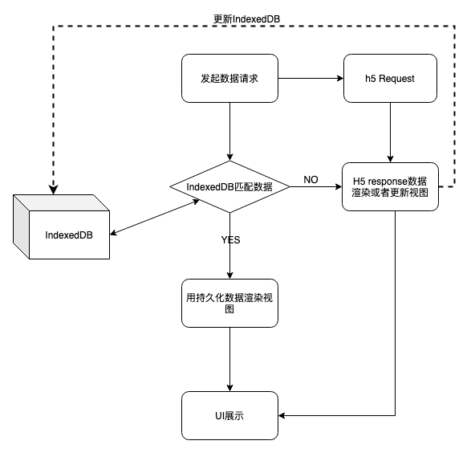

> 用于接口本地缓存的sdk

> 仓库地址：https://github.com/wuweikd/axios-indexedDB-sdk.git

```
┌─────────────────────────────────┐
│                                 │
│   Destination: dist/bundle.js   │
│   Bundle Size:  8.05 KB         │
│   Minified Size:  8.03 KB       │
│   Gzipped Size:  2.7 KB         │
│                                 │
└─────────────────────────────────┘

```

# 接口数据持久化方案
## 背景
在项目中，会通过接口请求大量的配置数据动态渲染页面，而大部分情况下，配置数据并无改变。若等待接口返回再开始渲染界面，会白白浪费用户等待时间。
故有了本次项目——接口数据进行本地化缓存。

## 原理
1. 通过`indexedDB`缓存每次请求的接口数据。
2. 请求接口之前，如果发现有缓存的数据，则首先读取缓存数据，待接口更新后再回调更新页面和更新数据库。
   

## 把此方案通用为SDK
SDK只暴露一个方法，只需调用此方法即可拦截并缓存接口。你可以理解此方法为一个自带拦截器的请求方法。
1. 方式一：支持传入 `AxiosRequestConfig, AxiosInstance`（请求参数、请求实例），自动缓存当前接口。
2. 方式二：支持传入自定义请求（Promise类型），自动拦截此promise，并缓存数据。
3. 支持传入回调方法，通过回调方法过滤接口的出入参，或者通过回调方法控制是否需要缓存。

## 使用方法

### 下载

```shell
# 方式一：代理axios方式
npm i @yy/axios-indexed-sdk axios

# 方式二：自定义的请求方式
npm i @yy/axios-indexed-sdk
```

### 使用

```js
import IDB from 'axios-indexeddb-sdk'
const md5 = require('md5')
// 初始化
const isRealData = ({data}) => data.code === '200' // 什么情况下存储的数据是有效的，如果发现存储的是无效数据则不读取数据库
const idb = new IDB({appKey: 'testAppKey'})
// 方式1：传入请求参数，自动缓存接口数据并响应数据（代理axios方式）
idb.httpWithIDB({
  DbHttp: axios, // 传入axios实例
  fetchKey: md5(JSON.stringify({param1: '123'})), // 请求的唯一key：使用md5发放用于生成请求的唯一key
  funName: 'myFunName',
  axiosRequestConfig: {
    method: 'get',
    url: 'xx/xx',
    params: {param1: '123'}
  },
  newDataCb: (data) => {
    console.log('数据改变了，返回有改变后的数据', data)
  }
}).then(res => {
  console.log('返回缓存数据，若无缓存数据返回请求数据', res)
})
// 方式2：传入自定义的请求方式，会拦截请求，并缓存请求结果
idb.httpWithIDB({
  fetchKey: '1641379655454', // 请求的唯一key
  funName: '610b9447c82fed7a0c87d245', // 请求的方法名称
  fetchPromise: myFetch, // Promise<any>，未实现，请自己构造请求Promise
  newDataCb: (data) => {
    console.log('数据改变了，返回有改变后的数据', data)
  }
}).then(res => {
  console.log('返回缓存数据，若无缓存数据返回请求数据', res)
})
```

### 类型解释

[点击查看：全部的类型定义](https://git.duowan.com/webs/efox/axios-indexed-sdk/-/blob/master/dist/index.d.ts)
> 若无权限，请申请仓库的权限；或者直接查看`npm i @yy/axios-indexed-sdk`之后的库文件

```ts
// 构造器定义
declare class Main extends Middleware {
  private readonly formatParams;  // 格式化入参的方法，用于过滤一些不想影响存储标志的东西
  private readonly formatResultData; // 格式化接口结果的方法，比如有些接口会返回随机数，需要过滤掉，免得影响判断数据是否有变化的逻辑
  private readonly isRealData; // 判断数据库的结果是否合法，合法才会读取数据库信息，否则直接走接口
  constructor({appKey, outTime, formatParams, isRealData, formatResultData, storeName}: {
    appKey: string; // 用于标记app的自定义字段，如收银台传efoxPayCsr
    outTime?: number; // 数据库的超时时间，毫秒数，默认7天
    formatParams?: TFormatParams; // 过滤掉无关的入参(全局级别过滤)
    isRealData?: TIsRealData; // 判断返回值是否合法，不合法就不会使用数据库(全局级别过滤)
    formatResultData?: TFormatResultData; // 格式化接口返回值(全局级别过滤)
    storeName?: string; // 数据库名称，默认为keyval-store
  });

  // 请求方法定义
  httpWithIDB({axiosRequestConfig, funName, DbHttp, newDataCb, fetchDataCb, formatParams, isRealData, formatResultData}: {
    axiosRequestConfig: AxiosRequestConfig; // 传axios的配置，如url，method，headers
    funName: string; // 方法名称，用于标记数据库字段
    DbHttp: AxiosInstance; // axiso 实例
    newDataCb: (data: any) => void; // 接口更新的回调，这里处理有改变的数据，有改变才回调
    fetchDataCb?:  ({data, isNewData}: {data: any, isNewData: boolean}) => void, // 请求的回调，一定会回调
    formatParams?: TFormatParams; // 过滤掉无关的入参(接口级别过滤)
    isRealData?: TIsRealData; // 判断返回值是否合法，不合法就不会使用数据库(接口级别过滤)
    formatResultData?: TFormatResultData; // 格式化接口返回值(接口级别过滤)
  }): Promise<any>;
}
```

### demo
1. 
2. demo1: 托管axios请求到sdk: https://github.com/wuweikd/axios-indexedDB-sdk/-/blob/master/test/index.html

3. demo2, 传入请求到sdk，自动竞速回调：https://github.com/wuweikd/axios-indexedDB-sdk/-/blob/master/test/index2.html


